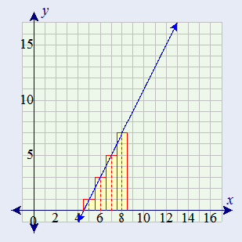

## Q1 :- Use integration by substitution to solve the integral below.

$$\int { { _{ 4e }{ -7x }_{ dx } } }$$
u=-7x
du=-7dx
dx=dU/-7
$$4\int { { e }^{ u } } \frac { du }{ -7 }$$
$$\frac { 4 }{ -7 } \int { { e }^{ u } } du$$
$$\frac { 4 }{ -7 } { e }^{ u }+\quad Constant$$
as u= -7x

$$\frac { 4 }{ -7 } { e }^{ -7x }+\quad Constant$$

## Q2:-Biologists are treating a pond contaminated with bacteria. The level of contamination is changing at a rate of dN/dt = -3150/t^4 - 220 bacteria per cubic centimeter per day, where t is the number of days since treatment began. Find a function N( t ) to estimate the level of contamination if the level after 1 day was 6530 bacteria per cubic centimeter.

N'(t)=(???3150/ t4)-220
$$N(t)\quad =\quad \int { (\frac { -3150 }{ { t }^{ 4 } } -220)dt } $$

when N=1, then

N(1)=1050 - 220 + Constant=6530,
hence Constant=5700

The function is 

N(t) = 1050 / t3 -220t +5700

## Q3:- Find the total area of the red rectangles in the figure below, where the equation of the line is f(x) = 2x - 9.
<CENTER></CENTER>

A : - 
Each square in the graph has an area of 1. Each rectangle has a width of 1. Counting each rectangle left to right the areas are 

Area=1+3+5+7=16.

But an better way would be to use integral to find the area

```{r}
findArea <- function(x)
  {
  2*x-9
}

integrate(findArea, lower = 4.5, upper = 8.5)
```

## Q4 :- Find the area of the region bounded by the graphs of the given equations. 
         y=x^2???2x???2   
         y=x+2
         
A:- 

```{r}
curve(x^2 - 2*x - 2, -5, 5)
curve(x + 2, -5, 5, add=T, col="red")
```

```{r}
((3/2)*4^2 +4*4 -(1/3)*4^3) - ((3/2)*(-1)^2 +4*(-1) -(1/3)*(-1)^3)
```
 The formula for finding the area enclosed by two curves is as follows :-
 
   $$\int _{ a }^{ b }{ (top-bottom)dx } $$
   Where a = -1 & b= 4 (We should get two values for x because of the quadratic term. x^2 -2x-2 = x+2 ~ (x-4)(x+10 )
   
   Function :-
   
   $$\int _{ -1 }^{ 4 }{ (x+2)-({ x }^{ 2 }-2x-2)dx } $$
   $$\int _{ -1 }^{ 4 }{ -{ x }^{ 2 }+3x+4)dx }$$ 
Using R in the above function(x)
```{r}
findArea <- function(x)
  {
  -x^{2}+3*x+4
  }


## integrate the function from 0 to infinity
integrate(findArea, lower = -1, upper = 4)
```
   
## Q5 :- A beauty supply store expects to sell 110 flat irons during the next year. It costs $3.75 to store one flat iron for one year. There is a fixed cost of $8.25 for each order. Find the lot size and the number of orders per year that will minimize inventory costs.

A:- 

   Assume 
    Y = cost 
    n = the no of orders per year 
    x = no of irons in order.
    thus 
    nx=110 so x=110n, assume half an order is in storage at on average. Such that,

$$Y\quad =8.25n\quad +\quad \frac { 3.75x }{ 2 } $$
if nx = 100 , then x= 100/n

$$Y\quad =8.25n\quad +\quad \frac { 206.25 }{ n } $$

$$Y`\quad =8.25\quad +\quad \frac { 206.25 }{ n^2 } $$
   
   if C`=0, then
   
   $$n\quad =\quad \sqrt { \frac { 206.25 }{ 8.25 }  } $$
   thus solving the above , we get n = 5 orders per year which will keep the inventory cost to minimum
   
## Q6 :- Use integration by parts to solve the integral below.
       $$ \int { ln(9x).{ x }^{ 6 }dx }  $$
A :- 

   $$ \int { udv\quad =\quad uv\quad -\quad \int { vdu }  }  $$
   u=ln(9x) 
   dv=x^6dx
   
   $$\frac { 1 }{ 7 } ln(9x){ x }^{ 7 }\quad -\quad \frac { 1 }{ 7 } \int { { x }^{ 6 }dx } \quad $$
   
   $$ \frac { 1 }{ 7 } ln(9x){ x }^{ 7 }\quad -\quad \frac { 1 }{ 7 } (\frac { { x }^{ 7 } }{ 7 } )\quad +\quad C\quad \quad   $$
$$ \frac { { x }^{ 7 } }{ 7 } \left[ n(9x)\quad -\frac { 1 }{ 7 }  \right] \quad +\quad C\quad \quad $$
## Q 7 :- Determine whether f ( x ) is a probability density function on the interval 1, e6 . If not, determine the value of the definite integral. f( x ) = 1 / 6x.

A:-   

 $$ \int _{ 1 }^{ { e }^{ 6 } }{ \frac { 1 }{ 6x }  } dx\quad \quad  $$
 $$ \frac { 1 }{ 6 } \int _{ 1 }^{ { e }^{ 6 } }{ \frac { 1 }{ x }  } dx\quad \quad$$
 
 $$ \frac { 1 }{ 6 } (ln({ e }^{ 6 })\quad -ln(1))\quad $$
 $$\frac { 1 }{ 6 } (6-0)\quad =\quad 1$$
 Hence the definite integral of the function on interval [1,e6] is 1
 
 
 
 
 
 
 
 
 
 
    
    
    
    
    
    
    
    
   
   


